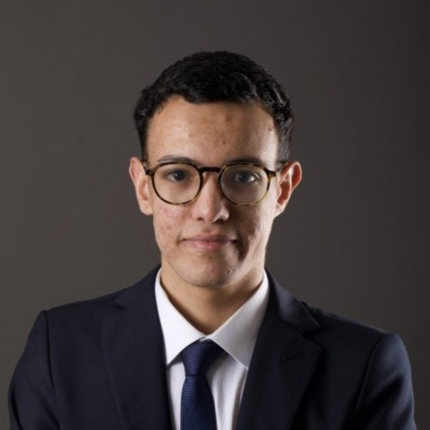

# 👋 Hi, I'm Oussama Zouhry

🎓 **École Polytechnique & MVA (ENS Paris-Saclay)**  
📍 Paris, France  
📧 oussama.zouhry@polytechnique.edu <!-- | 🌐 [oussamazouhry.com](https://oussamazouhry.com) -->

---

## 🚀 About Me

I'm a fourth-year engineering student at École Polytechnique and a Master’s student in the selective MVA program (Mathematics, Vision & Learning) at ENS Paris-Saclay.  
My research interests include: machine learning theory, generative models and combinatorial optimization.

Currently, I’m seeking a **research internship (Spring–Summer 2026)** focused on **AI methods, their theoretical foundations and applications**.

---

## 🧩 Experience

### 🔹 Research Intern — *New York University, Tandon School of Engineering*  
📅 *Apr 2025 – Jul 2025, New York (USA)*  
- Designed **novel combinatorial optimization algorithms** inspired by language models, statistical physics and information geometry  
- Conducted **large-scale HPC experiments** with PyTorch + SLURM, analyzed results via **Weights & Biases**

### 🔹 AI Consultant — *OCP Solutions*  
📅 *Jun 2024 – Sep 2024, Casablanca (Morocco)*  
- OCP Solutions is the consulting firm of OCP Group, a global mining company
- Developed **AI use cases** for agricultural clients: image classification & conversational chatbot  

---

## 🧠 Project Work

| Project | Description | Keywords |
|----------|--------------|-----------|
| **Graph Neural Networks for Node Classification** | Studied Lagrangian propagation as an optimization framework for GNNs; benchmarked on public datasets under Prof. Amine Aboussalah’s supervision. | Graph Learning, Optimization |
| **Traffic Optimization using Segment Routing** | Conducted extensive benchmarking on the latest advancements in internet routing. Worked with Prof. Éric Gourdin on leveraging segment routing techniques to enhance network efficiency and resilience. | Operations Research, Network Optimization, Routing |
| **Parallel Computing for Graph Theory** | Analyzed various approaches to the Maximal Independent Set problem, focusing on parallelization strategies. Implemented Luby’s Algorithm in Python, demonstrating the efficiency of parallel computing in large-scale graph analysis. | Parallel Computing, Graph Theory, Algorithms |
| **Quantum Information Networks** | Conducted a team research project supervised by Prof. Gilles Schaeffer (École Polytechnique) and Dr. Agathe Blaise (Thales SIX). Developed and implemented routing simulation tools comparing satellite vs. fiber quantum links for quantum key distribution (QKD) using the NetSquid library. *(École Polytechnique, 2023–2024)* | Routing, Quantum Networks, Simulation |
| **Graphical Languages for Quantum ML** | Explored diagrammatic calculus for quantum circuits and differentiable quantum programming (under Prof. Titouan Carette). | Quantum Machine Learning, Category Theory |

---

## ⚙️ Skills

**Programming:** Python (PyTorch, TensorFlow, Pandas, Git), JAX, SQL, OCaml, Agda  
**Machine Learning:** Transformers, Recurrent Neural Networks, Graph Neural Networks, Large Language Models, Natural Language Processing  
**Languages:** 🇫🇷 French (native), 🇲🇦 Arabic (native), 🇬🇧 English (TOEFL iBT 105), 🇪🇸 Spanish (beginner)

---

## 🏆 Awards & Achievements

- 🥉 **3rd Place – Perceval Quantum Challenge (Quandela)** *(30+ teams)*  
- 🎓 **Fellow – Moroccan Merit Scholarship** *(2022–2025)*  
- 🏅 **Runner-up – École Polytechnique International Entrance Exam**  
- 🧮 **Finalist – Moroccan IMO Team Selection Test (TST)** *(2020)*  
- 🧠 **Bronze Medal – Mediterranean Youth Mathematical Championship (MYMC)** *(2019)*

---
## 📚 Education

🎓 **M.Sc. in Mathematics, Vision & Learning (MVA)** — *ENS Paris-Saclay*  
📅 *Sep. 2025 – Aug. 2026*  
A selective, research-oriented master’s program in machine learning, computer vision, and mathematics. **Relevant Coursework:** Deep Learning, Large Language Models, Machine Learning for Time-Series, Reinforcement Learning, Optimal Transport for Machine Learning.  

---

🎓 **B.Sc. & M.Sc. in Applied Mathematics and Computer Science** — *École Polytechnique*  
📅 *Sep. 2022 – Aug. 2026*  
One of France’s leading schools for sciences and engineering. 
**Relevant coursework:** Probability & Statistics, Algorithms for Data Analysis, Machine and Deep Learning, Optimization.  

---

🎓 **Classes Préparatoires (Lycée Louis-le-Grand, Paris)** — Mathematics, Physics & Computer Science  
📅 *Sep. 2020 – Jun. 2022*  
Two years of intensive training in advanced mathematics and physics for France’s most selective scientific entrance exams. Admitted to École Polytechnique and ENS Ulm Paris.

---

## 🌍 Volunteering

- 💼 **Treasurer @ Math&Maroc** - Managed a **$50k+ annual budget**, led partnerships and sponsorships, and organized an AI Hackathon gathering over 75 graduate participants across Morocco.  
- 👨‍🏫 **Teaching Assistant @ Lycée Paul-Éluard (Seine-Saint-Denis)** - Designed and graded problem sets for 200+ high-school students from underprivileged backgrounds as part of École Polytechnique’s outreach program.  
- 🌟 **Vice President @ X-Maroc (École Polytechnique)** - Represented Moroccan students within Ecole Polytechnique and organized on-campus and off-campus cultural events. 
---

<!-- 
## 🌌 Current Goals

I’m passionate about **bridging theoretical insights and practical AI** — exploring how **information geometry, optimization, and quantum ideas** can inspire the next generation of learning algorithms.  
If you’re working on similar research topics, I’d love to connect or collaborate!
---
-->

## 📫 Connect with Me

<!--  -->

---
